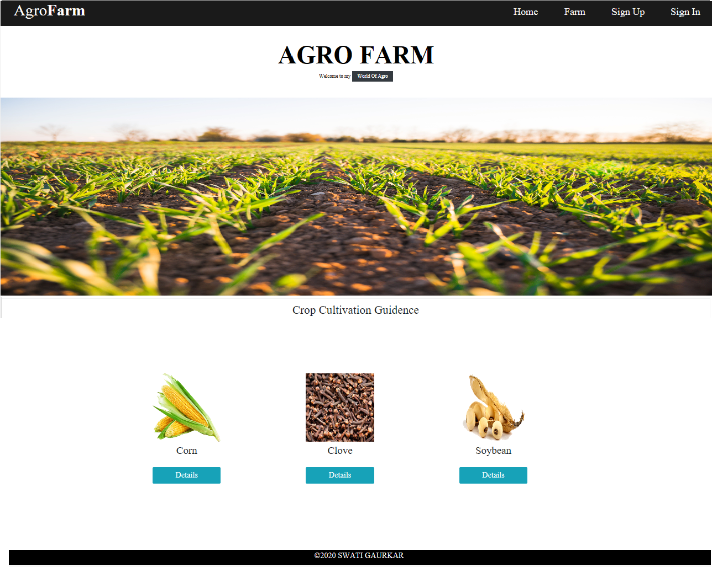

# AgroFarm
Java Project

The Agro-farm is to provide information about crop cultivation. The system allows
authorized persons to views crop information.

Home Page

Registration Page 

Database Page

Login Page 

Password Forgot Page 

Crop list Page 

Crop Information Page 

